<div align="center">
  
# 👋 Hi, I'm Rakshit Singh

### 🚀 Full-Stack Developer | Web3 Enthusiast | Systems Programmer


[](https://rakshitsingh.space)
[](https://github.com/Rakshitsinghhh)
[](https://github.com/Rakshitsinghhh)

</div>

---

## 💫 About Me

```typescript
const rakshit = {
    location: "Jaipur, India 🇮🇳",
    currentFocus: ["Web3", "Cloud Systems", "Full-Stack Development"],
    expertise: ["Low-Level Programming", "Complex Problem Solving"],
    learning: ["Rust", "Blockchain", "Google Cloud Platform"],
    passions: ["Building Challenging Projects", "Open Source"],
    availableFor: "Innovative collaborations and opportunities"
};
```

> 🎯 Passionate about solving complex problems and building scalable, efficient systems from the ground up.

---

## LeetCode


<p align="center">
  <a href="https://leetcode.com/rakshitsinghhh/" target="_blank"></a>
  <a href="https://leetcode.com/rakshitsinghhh/" target="_blank"></a>
  <a href="https://leetcode.com/rakshitsinghhh/" target="_blank"></a>
  <a href="https://leetcode.com/rakshitsinghhh/" target="_blank"></a>
  <a href="https://leetcode.com/rakshitsinghhh/" target="_blank">
</a>
  <a href="https://leetcode.com/rakshitsinghhh/" target="_blank"></a>
  <a href="https://leetcode.com/rakshitsinghhh/" target="_blank"></a>
  <a href="https://leetcode.com/rakshitsinghhh/" target="_blank"></a>
</p>

## 🛠️ Tech Arsenal

<details open>
<summary><b>🔥 Core Languages</b></summary>
<br>


</details>

<details open>
<summary><b>🌐 Web Technologies</b></summary>
<br>


</details>

<details open>
<summary><b>☁️ DevOps & Cloud</b></summary>
<br>


</details>

<details open>
<summary><b>🗄️ Database & Design</b></summary>
<br>


</details>

---

## 🌱 Currently Learning

<table>
<tr>
<td width="33%" valign="top">

### ⛓️ Blockchain & Web3
```rust
// Building the decentralized future
fn main() {
    println!("Rust blockchain node 🦀");
}
```
- 🦀 **Rust** - Systems programming
- 📜 **Solidity** - Smart contracts
- 🌐 **Web3.js** - Blockchain integration
- 🔗 **DApps** - Decentralized applications

</td>
<td width="33%" valign="top">

### 💻 Systems Programming
```cpp
// Low-level optimization
class SystemsPro {
public:
    void optimize() {
        // Advanced C++ magic ✨
    }
};
```
- ⚡ **Advanced C++**
- 🐧 **Linux Kernel**
- 🔧 **Performance tuning**
- 🎯 **Memory management**

</td>
<td width="33%" valign="top">

### ☁️ Cloud & Backend
```yaml
# Scalable infrastructure
services:
  app:
    image: rakshit/awesome-app
    deploy: gcp 🚀
```
- 🌩️ **Google Cloud Platform**
- 🏗️ **Microservices architecture**
- 🔄 **CI/CD Pipelines**
- 📦 **Container orchestration**

</td>
</tr>
</table>

---

## 🚀 Current Projects

```mermaid
graph LR
    A[🦀 Rust Blockchain Node] -->|In Progress| B[Building P2P Network]
    E[🔐 Web3 Auth System] -->|Planning| F[Decentralized Identity]
    
    style A fill:#ff6b6b
    style E fill:#45b7d1
```



### 🎯 Featured Work
- 🔗 **Rust Blockchain Node** - Building a decentralized P2P network from scratch
- ☁️ **GCP Deployment Pipelines** - Automated cloud infrastructure with Docker
- 🔐 **Web3 Authentication** - Next-gen decentralized identity system

> 📚 Check out my [repositories](https://github.com/Rakshitsinghhh?tab=repositories) for more projects!

---

## 📊 GitHub Stats

<div align="center">
  


</div>

<div align="center">
  
[](https://git.io/streak-stats)

</div>

---

## 💻 LeetCode Stats

<div align="center">

### 🔥 Problem Solving Journey


### 📈 LeetCode Badges

[](https://leetcode.com/Rakshitsinghhh/)
[](https://leetcode.com/Rakshitsinghhh/)

</div>

---

## 🏆 GitHub Trophies

<div align="center">

[](https://github.com/ryo-ma/github-profile-trophy)

</div>

---

## 📈 Contribution Graph

<div align="center">

[](https://github.com/ashutosh00710/github-readme-activity-graph)

</div>

---

## 💼 Let's Connect

<div align="center">

[](mailto:singhrakshit2404@gmail.com)
[](https://linktr.ee/rakshitsinghhh)
[](https://github.com/Rakshitsinghhh)

</div>

---

<div align="center">

### 💡 Quote of the Day


### 🎮 When I'm Not Coding...

```javascript
const rakshit = {
    coffee: "☕ Lots of it",
    music: "🎵 Always coding with beats",
    learning: "📚 Never stops",
    building: "🔨 The next big thing"
};
```


---

⭐ **If you like my work, consider giving me a star!** ⭐


**💼 Open to collaborations | 🚀 Always learning | 🌟 Building the future**

</div>
